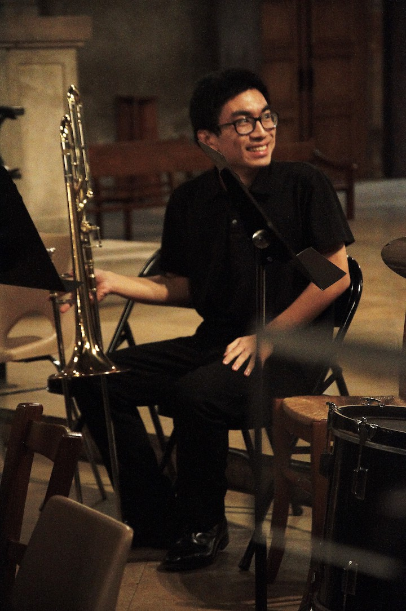

{:width="240px"}
 
<small>Photo credit: Flora Gaudillière, 2019</small>

| address: | I am currently here But at some point I'll be somewhere else
|---------:|:------------------------------------------------------------------
|   email: | firstlast@kth.se
| twitter: | [@{{ site.twitter.username }}](https://twitter.com/{{ site.twitter.username }})
|  github: | [@{{ site.github.username }}](https://github.com/{{ site.github.username }})

Isaac Ren
=========
{: title="The 'X' in the URL is my middle initial, Xiaoran :)"}

I am a math PhD student at
[KTH Royal Institute of Technology](https://www.kth.se/) in Stockholm, under
the supervision of Associate Professor
[Martina Scolamiero](https://www.kth.se/profile/scola). My official profile
page is [here](https://www.kth.se/profile/isaacren).

My research interests include topological data analysis and homological
algebra. I have also worked on algebraic rewriting theory and computational
aspects of knot homology.

I have previously studied at École Normale Supérieure de Lyon and Lycée Louis
le Grand. I speak English and French.

Preprints & publications
------------------------

### Preprints


* ["{{ item.title }},"]({{ item.url }}) with {{ item.authors }}, {{ item.year }}. {{ item.comment }}.


### Journal publications


* ["{{ item.title }},"]({{ item.url }}) with {{ item.authors }}, {{ item.location }}, {{ item.year }}. [arXiv version]({{ item.arxiv }}).


### Conference papers


* ["{{ item.title }},"]({{ item.url }}) with {{ item.authors }}, {{ item.location }}, {{ item.year }}.


Conferences & seminars
----------------------


* "{{ item.title }}," {{""}}
  
    with {{ item.cospeakers }}, {{""}}
  
  [{{ item.conference }}]({{ item.conf_url }}), {{ item.date }}. {{ item.location }}
  
  : 
  
    , 
    [slides]({{ item.slides }})
    
  
  
    , 
    [video]({{ item.video }})
    
  
  
    
      , 
      [slides]({{ subitem.slides }})
      
    
    
      , 
      [video]({{ subitem.video }})
      
    
    {{""}} from a similar talk at [{{ subitem.conference }}]({{ subitem.conf_url }})
  
  .


Software
--------


* [**{{ item.title }}**]({{ item.url }}), {{ item.description }}.


<small>
</small>
<small markdown="1">
Typeset in [Fraunces](https://fraunces.undercase.xyz/) by Undercase Type.
 
Note: many links on this webpage are external, and so are subject to the
lifespans of the hosting websites.
 
Last updated {{ site.time | date_to_string }}.</small>

